# AI LinguAI (A20-App-014)

Nền tảng luyện nói tiếng Anh tích hợp AI theo hướng sản phẩm thực tế: hội thoại theo chủ đề, phản hồi ngữ pháp, chấm phát âm chi tiết, theo dõi tiến bộ và vòng lặp ôn tập bằng flashcard.

## 1. Mục tiêu dự án

- Giúp người học luyện nói đều đặn trong môi trường mô phỏng thực tế.
- Trả phản hồi nhanh, rõ ràng, có thể áp dụng ngay.
- Theo dõi tiến bộ theo phiên và theo thời gian.
- Tập trung vào trải nghiệm liền mạch: từ nói -> nhận feedback -> ôn tập.

## 2. Tính năng chính

### 2.1 Luyện hội thoại AI (Text + Audio)
- Chat theo chủ đề (IELTS, daily, business, ...).
- Gửi text hoặc ghi âm trực tiếp.
- STT tự động khi người dùng gửi audio.
- AI phản hồi bằng text và giọng nói (TTS).

### 2.2 Feedback ngữ pháp
- Highlight lỗi theo từng đoạn chữ.
- Trả câu sửa gợi ý, phân loại lỗi, giải thích ngắn.
- Lưu theo message để xem lại khi mở lại lịch sử.

### 2.3 Chấm phát âm chuyên sâu
- Tích hợp Azure Pronunciation Assessment.
- Điểm thành phần: overall, accuracy, fluency, completeness, prosody.
- Drill-down tới word/syllable/phoneme.

### 2.4 Dashboard tiến bộ
- Tổng số phiên, thời lượng luyện, streak.
- Biểu đồ xu hướng điểm và quy đổi dạng band.
- Gợi ý hướng cải thiện theo điểm yếu.

### 2.5 Flashcard learning loop
- CRUD deck/card.
- Upload media (image/audio) cho từng mặt thẻ.
- Ôn tập theo thuật toán SM-2 (spaced repetition).

### 2.6 Bảo mật và guardrails
- JWT auth, password policy mạnh, OAuth.
- Input/output guardrails (rate limit, injection filter, redaction).
- Audit logging và trace observability.

## 3. Kiến trúc tổng quan

### 3.1 Frontend
- React + Vite + TypeScript + Tailwind
- Các màn hình chính:
- `/chat`: Voice Agent
- `/dashboard`: tiến bộ học tập
- `/flashcards/*`: quản lý và học flashcard

### 3.2 Backend
- FastAPI, REST API dưới `/api`
- Pipeline AI (LangGraph): preflight -> respond/tool -> TTS
- Service tích hợp:
- Groq (STT + LLM)
- ElevenLabs (TTS)
- Azure Speech (assessment)

### 3.3 Data & Storage
- PostgreSQL: auth, conversation, grammar, pronunciation, flashcard
- MinIO: audio messages, flashcard media
- Redis: rate limiting

### 3.4 Observability
- Prometheus + Grafana (metrics)
- Elasticsearch + Kibana + Vector (logs)

## 4. Cấu trúc dịch vụ (Docker Compose)

Stack local gồm:
- `voice_agent_backend`
- `voice_agent_frontend`
- `voice_agent_postgres`
- `voice_agent_redis`
- `voice_agent_minio`
- `voice_agent_pgadmin`
- `voice_agent_prometheus`
- `voice_agent_grafana`
- `voice_agent_elasticsearch`
- `voice_agent_kibana`
- `voice_agent_vector`

## 5. Yêu cầu môi trường

- Docker Desktop
- Python 3.10+
- Node.js 18+
- Git
- (Khuyến nghị) `uv` để quản lý môi trường Python

## 6. Hướng dẫn cài đặt và chạy

### 6.1 Clone mã nguồn

```bash
git clone <your-repo-url>
cd A20-App-014-me
```

### 6.2 Tạo file môi trường

```powershell
Copy-Item .env.example .env
```

Biến quan trọng cần cấu hình:
- `JWT_SECRET_KEY`
- `POSTGRES_DB`, `POSTGRES_USER`, `POSTGRES_PASSWORD`
- `MINIO_ACCESS_KEY`, `MINIO_SECRET_KEY`
- `GROQ_API_KEY`
- `ELEVENLABS_API_KEY`
- `VITE_API_BASE_URL`

Biến tùy chọn cho pronunciation:
- `AZURE_SPEECH_KEY`
- `AZURE_SERVICE_REGION` (hoặc `AZURE_SPEECH_REGION`)

### 6.3 Chạy toàn bộ stack bằng Docker

```bash
docker compose up -d --build
```

Kiểm tra dịch vụ:

```bash
docker compose ps
```

### 6.4 Health check backend

```bash
curl http://localhost:8000/health
```

Kết quả mong đợi:

```json
{"status":"ok"}
```

### 6.5 Chạy frontend ở chế độ dev (tùy chọn)

```bash
cd frontend
npm install
npm run dev
```

URL: `http://localhost:5173`

## 7. API chính

- `POST /api/auth/register`
- `POST /api/auth/login`
- `GET /api/auth/me`
- `POST /api/chat/respond`
- `POST /api/chat/transcribe`
- `POST /api/assess`
- `GET /api/conversations`
- `GET /api/conversations/{id}/messages-with-scores`
- `GET /api/topics/get_categories_topics`
- `GET|POST|PATCH|DELETE /api/flashcards/*`

## 8. Kiểm thử

Ví dụ chạy nhanh một số nhóm test backend:

```bash
python -m pytest tests/test_security/test_security.py tests/test_api/test_routes.py -q
python -m pytest tests/test_api/test_schemas.py tests/test_ai_services/test_ai_services.py -q
```

## 9. Gợi ý vận hành

- Nếu thay đổi schema, reset volume DB trước khi seed lại.
- Với môi trường production/staging, bắt buộc dùng secret mạnh và endpoint storage/public URL đúng domain.
- Theo dõi metrics và logs trước khi mở traffic thật.

## 10. Thông tin dự án / Demo

### 10.1 Ảnh minh họa hệ thống

#### A. Luồng chính của hệ thống

1. Luồng hoạt động end-to-end của AI LinguAI

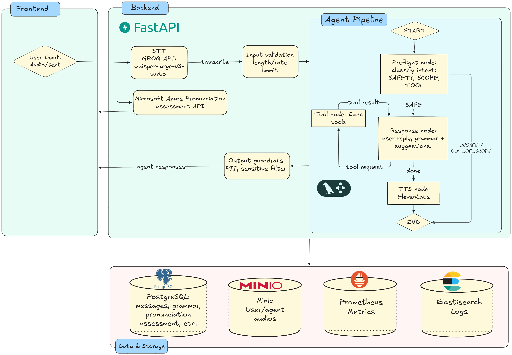

#### B. Hạ tầng triển khai

2. Cụm Kubernetes trên Google Cloud

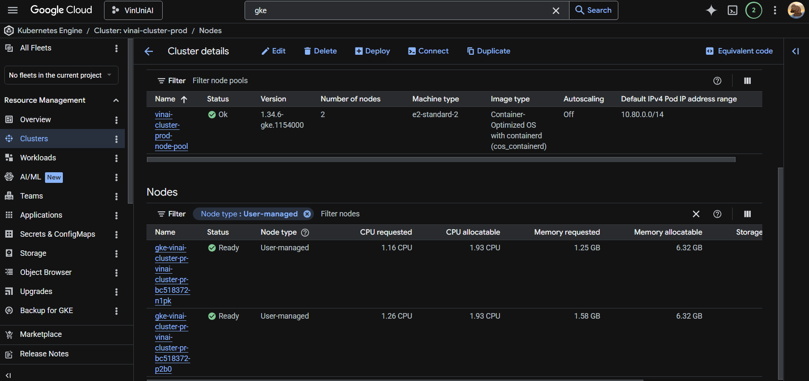

3. Cơ sở dữ liệu production trên Google Cloud

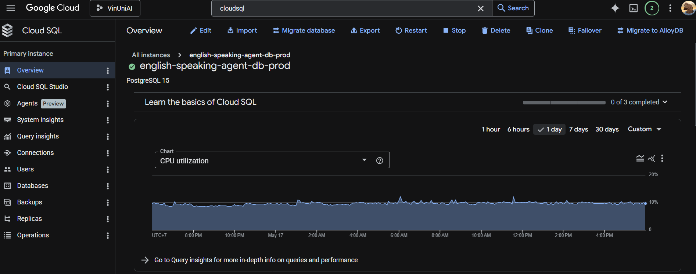

4. Quản trị Kubernetes bằng Rancher

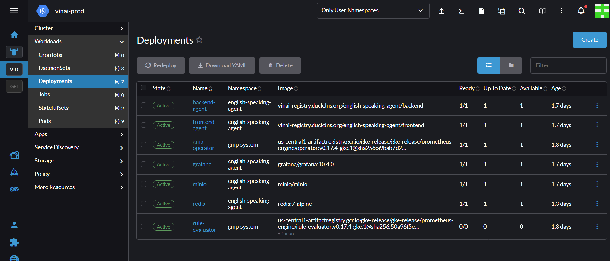

#### C. CI/CD và Registry

5. Pipeline CI/CD tổng thể

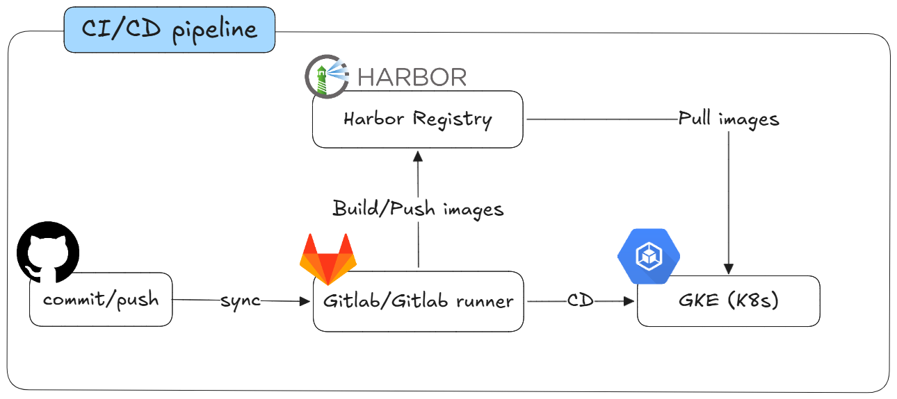

6. Pipeline CI/CD trên GitLab

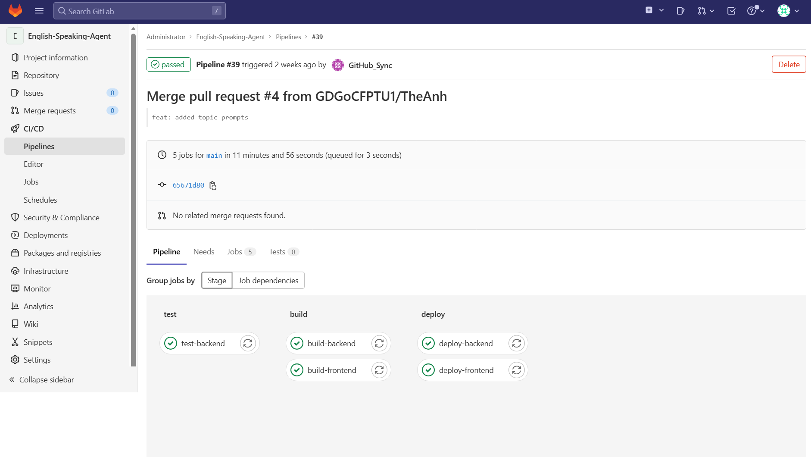

7. Harbor container registry

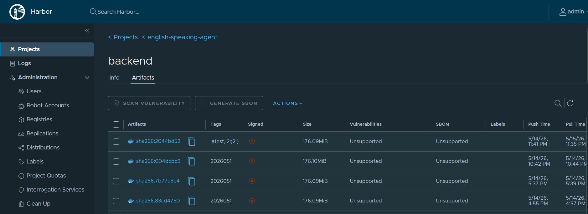

#### D. Quan sát hệ thống

8. Logging pipeline (thu thập và đẩy log)

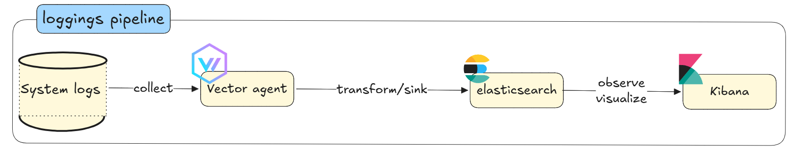

9. Monitoring pipeline (metrics và giám sát)

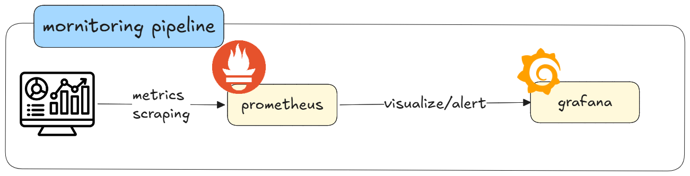

10. Log monitoring trên Kibana

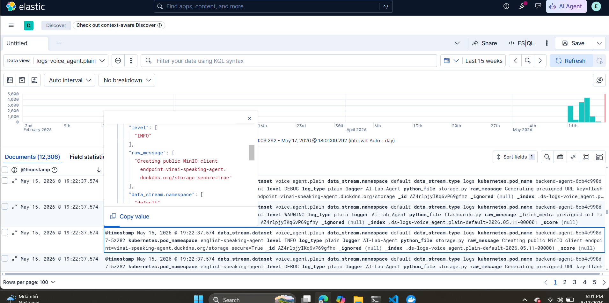

11. Trace/LLM monitoring trên LangSmith

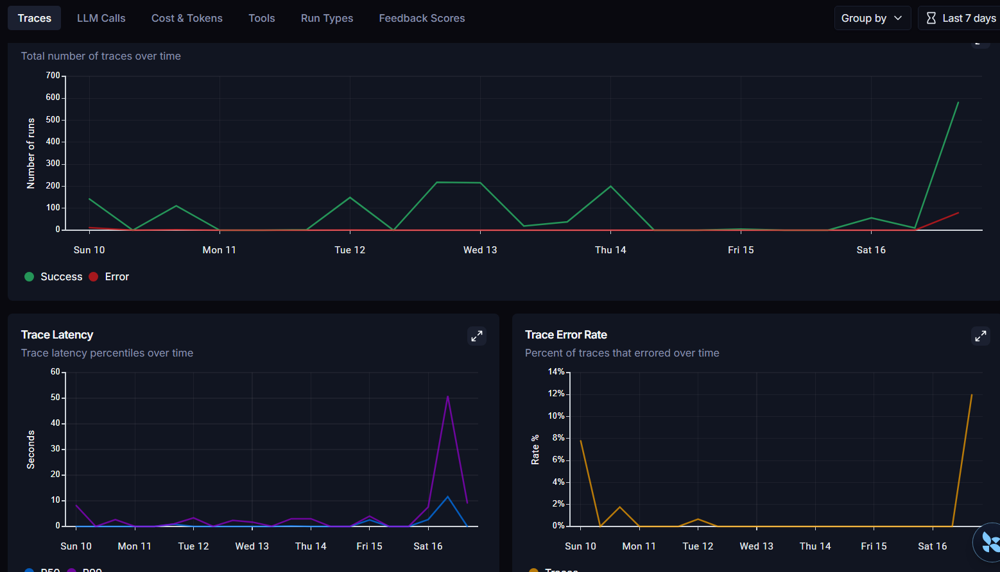

#### E. Lưu trữ object

12. MinIO Object Storage

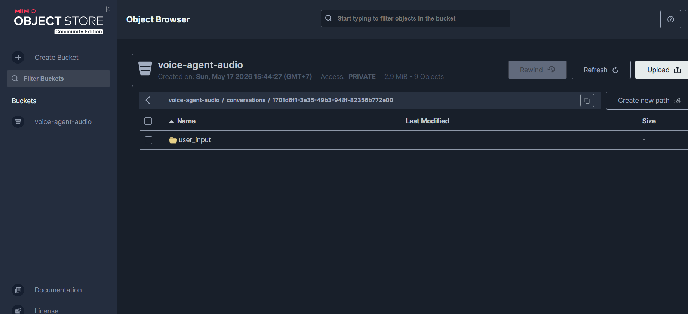

### 10.2 Video demo

<div align="center">

  <br/>
  <video 
    src="docs/demo/demo.mp4" 
    controls 
    width="90%"
    style="
    border-radius: 18px;
    overflow: hidden;
    border: 1px solid #30363d;
    box-shadow: 0 10px 35px rgba(0,0,0,0.35);">
  </video>
  <br/>
  <br/>
  <sub style="
    font-size: 19px;
    font-weight: 600;
    letter-spacing: 3px;
    text-transform: uppercase;">
  🎥 Video demo web LinguAI
  </sub>
  <br/>
  <br/>
</div>