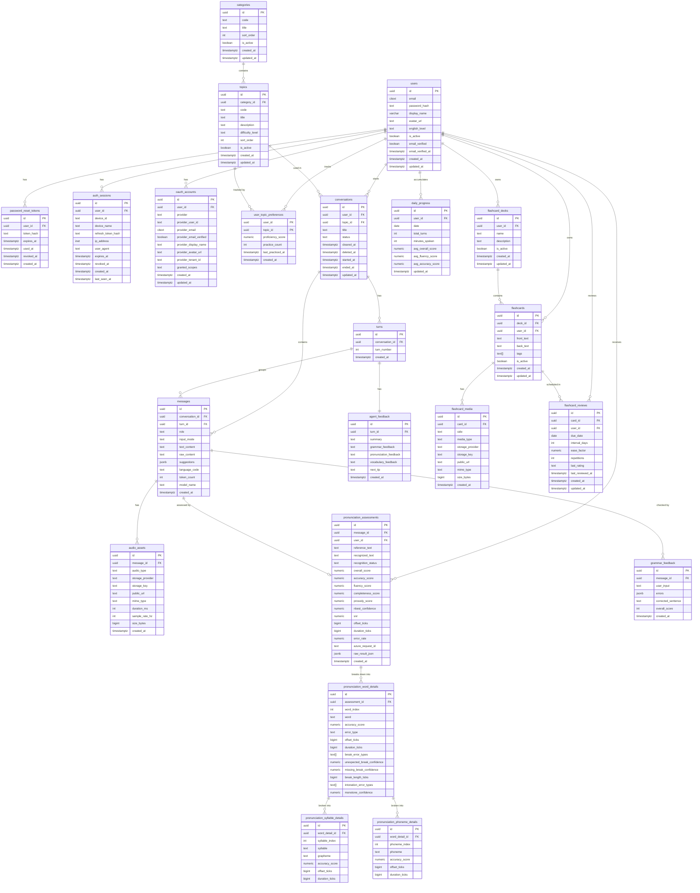

# Biểu Đồ Quan Hệ Thực Thể (Entity Relationship Diagram)

Được hiển thị tự động trên GitHub và GitLab.

```mermaid
erDiagram

    %% =====================
    %% 1) USERS & AUTH
    %% =====================

    users {
        uuid id PK
        citext email
        text password_hash
        varchar display_name
        text avatar_url
        text english_level
        boolean is_active
        boolean email_verified
        timestamptz email_verified_at
        timestamptz created_at
        timestamptz updated_at
    }

    password_reset_tokens {
        uuid id PK
        uuid user_id FK
        text token_hash
        timestamptz expires_at
        timestamptz used_at
        timestamptz revoked_at
        timestamptz created_at
    }

    auth_sessions {
        uuid id PK
        uuid user_id FK
        text device_id
        text device_name
        text refresh_token_hash
        inet ip_address
        text user_agent
        timestamptz expires_at
        timestamptz revoked_at
        timestamptz created_at
        timestamptz last_seen_at
    }

    oauth_accounts {
        uuid id PK
        uuid user_id FK
        text provider
        text provider_user_id
        citext provider_email
        boolean provider_email_verified
        text provider_display_name
        text provider_avatar_url
        text provider_tenant_id
        text granted_scopes
        timestamptz created_at
        timestamptz updated_at
    }

    %% =====================
    %% 2) CATEGORIES & TOPICS
    %% =====================

    categories {
        uuid id PK
        text code
        text title
        int sort_order
        boolean is_active
        timestamptz created_at
        timestamptz updated_at
    }

    topics {
        uuid id PK
        uuid category_id FK
        text code
        text title
        text description
        text difficulty_level
        int sort_order
        boolean is_active
        timestamptz created_at
        timestamptz updated_at
    }

    user_topic_preferences {
        uuid user_id PK
        uuid topic_id PK
        numeric proficiency_score
        int practice_count
        timestamptz last_practiced_at
        timestamptz created_at
    }

    %% =====================
    %% 3) CONVERSATIONS / TURNS / MESSAGES
    %% =====================

    conversations {
        uuid id PK
        uuid user_id FK
        uuid topic_id FK
        text title
        text status
        timestamptz cleared_at
        timestamptz deleted_at
        timestamptz started_at
        timestamptz ended_at
        timestamptz updated_at
    }

    turns {
        uuid id PK
        uuid conversation_id FK
        int turn_number
        timestamptz created_at
    }

    messages {
        uuid id PK
        uuid conversation_id FK
        uuid turn_id FK
        text role
        text input_mode
        text text_content
        text raw_content
        jsonb suggestions
        text language_code
        int token_count
        text model_name
        timestamptz created_at
    }

    %% =====================
    %% 4) AUDIO ASSETS
    %% =====================

    audio_assets {
        uuid id PK
        uuid message_id FK
        text audio_type
        text storage_provider
        text storage_key
        text public_url
        text mime_type
        int duration_ms
        int sample_rate_hz
        bigint size_bytes
        timestamptz created_at
    }

    %% =====================
    %% 5) PRONUNCIATION ASSESSMENT
    %% =====================

    pronunciation_assessments {
        uuid id PK
        uuid message_id FK
        uuid user_id FK
        text reference_text
        text recognized_text
        text recognition_status
        numeric overall_score
        numeric accuracy_score
        numeric fluency_score
        numeric completeness_score
        numeric prosody_score
        numeric nbest_confidence
        numeric snr
        bigint offset_ticks
        bigint duration_ticks
        numeric error_rate
        text azure_request_id
        jsonb raw_result_json
        timestamptz created_at
    }

    pronunciation_word_details {
        uuid id PK
        uuid assessment_id FK
        int word_index
        text word
        numeric accuracy_score
        text error_type
        bigint offset_ticks
        bigint duration_ticks
        text[] break_error_types
        numeric unexpected_break_confidence
        numeric missing_break_confidence
        bigint break_length_ticks
        text[] intonation_error_types
        numeric monotone_confidence
    }

    pronunciation_syllable_details {
        uuid id PK
        uuid word_detail_id FK
        int syllable_index
        text syllable
        text grapheme
        numeric accuracy_score
        bigint offset_ticks
        bigint duration_ticks
    }

    pronunciation_phoneme_details {
        uuid id PK
        uuid word_detail_id FK
        int phoneme_index
        text phoneme
        numeric accuracy_score
        bigint offset_ticks
        bigint duration_ticks
    }

    %% =====================
    %% 6) AGENT FEEDBACK
    %% =====================

    agent_feedback {
        uuid id PK
        uuid turn_id FK
        text summary
        text grammar_feedback
        text pronunciation_feedback
        text vocabulary_feedback
        text next_tip
        timestamptz created_at
    }

    %% =====================
    %% 7) DAILY PROGRESS
    %% =====================

    daily_progress {
        uuid id PK
        uuid user_id FK
        date date
        int total_turns
        int minutes_spoken
        numeric avg_overall_score
        numeric avg_fluency_score
        numeric avg_accuracy_score
        timestamptz updated_at
    }

    %% =====================
    %% 9) GRAMMAR FEEDBACK
    %% =====================

    grammar_feedback {
        uuid id PK
        uuid message_id FK
        text user_input
        jsonb errors
        text corrected_sentence
        int overall_score
        timestamptz created_at
    }

    %% =====================
    %% 10) FLASHCARDS
    %% =====================

    flashcard_decks {
        uuid id PK
        uuid user_id FK
        text name
        text description
        boolean is_active
        timestamptz created_at
        timestamptz updated_at
    }

    flashcards {
        uuid id PK
        uuid deck_id FK
        uuid user_id FK
        text front_text
        text back_text
        text[] tags
        boolean is_active
        timestamptz created_at
        timestamptz updated_at
    }

    flashcard_media {
        uuid id PK
        uuid card_id FK
        text side
        text media_type
        text storage_provider
        text storage_key
        text public_url
        text mime_type
        bigint size_bytes
        timestamptz created_at
    }

    flashcard_reviews {
        uuid id PK
        uuid card_id FK
        uuid user_id FK
        date due_date
        int interval_days
        numeric ease_factor
        int repetitions
        text last_rating
        timestamptz last_reviewed_at
        timestamptz created_at
        timestamptz updated_at
    }

    %% =====================
    %% RELATIONSHIPS
    %% =====================

    users ||--o{ password_reset_tokens : "has"
    users ||--o{ auth_sessions : "has"
    users ||--o{ oauth_accounts : "has"
    users ||--o{ user_topic_preferences : "tracks"
    users ||--o{ conversations : "starts"
    users ||--o{ pronunciation_assessments : "receives"
    users ||--o{ daily_progress : "accumulates"
    users ||--o{ flashcard_decks : "owns"
    users ||--o{ flashcards : "owns"
    users ||--o{ flashcard_reviews : "reviews"

    categories ||--o{ topics : "contains"

    topics ||--o{ user_topic_preferences : "tracked by"
    topics ||--o{ conversations : "used in"

    conversations ||--o{ turns : "has"
    conversations ||--o{ messages : "contains"

    turns ||--o{ messages : "groups"
    turns ||--|| agent_feedback : "has"

    messages ||--o{ audio_assets : "has"
    messages ||--o| pronunciation_assessments : "assessed by"
    messages ||--o{ grammar_feedback : "checked by"

    pronunciation_assessments ||--o{ pronunciation_word_details : "breaks down into"

    pronunciation_word_details ||--o{ pronunciation_syllable_details : "broken into"
    pronunciation_word_details ||--o{ pronunciation_phoneme_details : "broken into"

    flashcard_decks ||--o{ flashcards : "contains"

    flashcards ||--o{ flashcard_media : "has"
    flashcards ||--o{ flashcard_reviews : "scheduled in"
```
